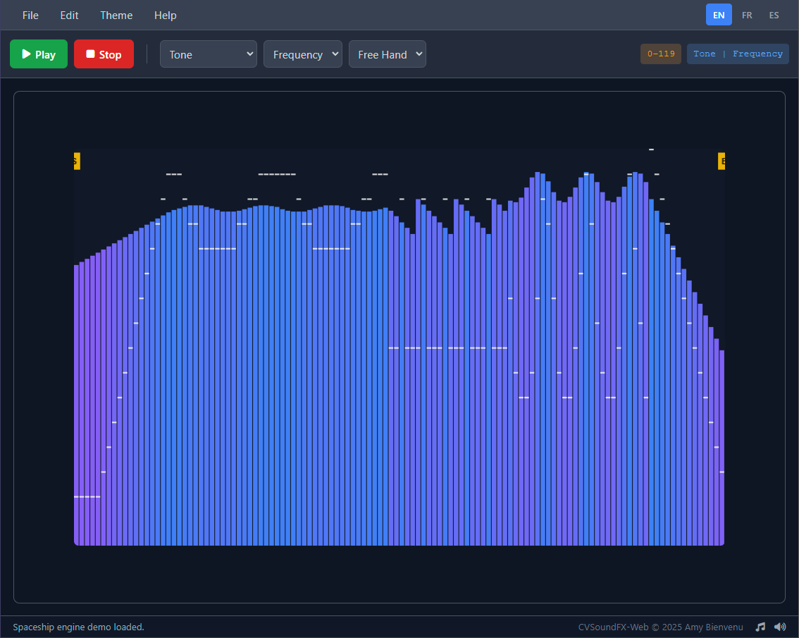

# CVSoundFX-Web

**CVSoundFX-Web** is a modern, browser-based sound effect editor for the ColecoVision console. It is a complete rewrite and enhancement of the original Java-based `CVSoundFX` tool, designed for the modern web.

This tool allows retro game developers and hobbyists to visually create and edit sound effects and export them into formats compatible with ColecoVision development tools.

## Features

* **Visual Sound Editing**: "Draw" your sound effects by manipulating frequency and volume over 120 steps.
* **Real-time Audio Preview**: Listen to your creations instantly in the browser, powered by the Web Audio API which emulates the ColecoVision's sound chip.
* **Multiple Sound Modes**: Supports Tone, Periodic Noise, and White Noise modes.
* **Selection Range**: Define start and end points to play and export only the parts of the sound you need.
* **File Support**: Save and load your work in the `.sfx` format. Also supports drag-and-drop loading.
* **Export for Development**:
    * Export to **Assembly** (`.s`) for use with SDCC and other assemblers.
    * Export to **CVBASIC** (`.bas`) for easy integration with CVBasic/IntyBASIC projects.
* **Modern Interface**: A clean, responsive, and easy-to-use interface built with Tailwind CSS.
* **Multi-language Support**: Interface available in English, French, and Spanish.

## How to Use

1.  **Open the Web App**: Simply open the `index.html` file in any modern web browser.
2.  **Create a Sound**:
    * Use the dropdowns in the toolbar to select a **Sound Mode** (Tone, Periodic Noise, etc.) and a **Cursor Mode** (Frequency, Volume, etc.).
    * Click and drag on the main editor canvas to change the values.
    * Drag the **S** (Start) and **E** (End) handles at the top of the editor to define the active range for playback and export.
3.  **Playback**:
    * Click the **Play** button to hear the sound effect within the selected range.
    * Click **Stop** to halt playback.
4.  **Save & Load**:
    * Use **File > Save** to download your entire 120-step sound effect as a `.sfx` file. Your selection range is saved with it.
    * Use **File > Open** or drag-and-drop a `.sfx` file onto the editor to load your work.
5.  **Export**:
    * Go to **File > Export ASM...** or **File > Export CVBASIC...** to generate code for your project. The exported code will only include the data within your selected Start/End range.

## Credits

* **Original Concept & Java Version (2014)**: Amy Bienvenu
* **CVBASIC Converter Logic**: Oscar Toledo
* **Web Version (2025)**: Created by Amy Bienvenu with AI assistance.

This project was lovingly brought to the web to support the vibrant ColecoVision and retro game development community.

## License

This project is open-source. Please feel free to use, modify, and distribute it.
